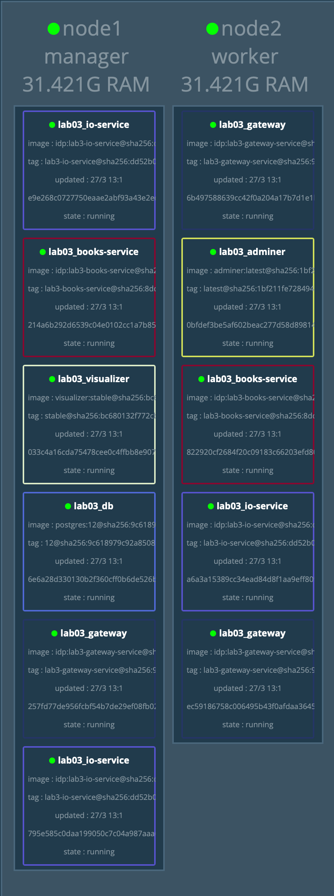

# Laborator 03 - Docker Swarm

## Arhitectura Docker Swarm
* bazata pe algoritmul distribuit [Raft](https://raft.github.io)

## Retele Swarm
* retelele sunt de tip **overlay**
* porturile unice expuse sunt unice pe retea

## Stiva de servicii Swarm

```bash
docker stack deploy -c my_stack.yml lab3 # deploy la o lista de servicii
docker stack ps lab3 # verificare status stiva de servicii
docker stack ls # vizualizare lista de servicii
docker service ls # vizualizare lista de servicii din toate stivele pornite
```

## Docker Machine

```bash
$ docker-machine create [--driver <DRIVER>] <NUME> # creează o mașină virtuală Docker
$ docker-machine start <NUME>                      # pornește o mașină virtuală Docker
$ docker-machine stop <NUME>                       # oprește o mașină virtuală Docker
$ docker-machine rm <NUME>                         # șterge o mașină virtuală Docker
$ docker-machine ls                                # listează toate mașinile virtuale Docker
$ docker-machine ssh <NUME>                        # se conectează prin SSH la o mașină virtuală Docker
$ docker-machine scp <FISIER> <NUME>:<DESTINATIE>  # copiază un fișier pe o mașină virtuală Docker
```

## Play With Docker
* similar cu Docker Machine, doar ca online

## Exercitii
1. Demo
* exercitiul cu books api de la lab02 cu swarm

```bash
# creare masini
docker-machine create --driver virtualbox myvm1
docker-machine create --driver virtualbox myvm2

# init swarm 

# myvm1
docker swarm init --advertise-addr <eth1-interface-addr>

# myvm2
docker swarm join ...

# myvm1
docker node ls

# local
docker-machine scp docker-swarm.yml myvm1:.
docker-machine scp -r database myvm1:.

# myvm1
docker stack deploy -c docker-swarm.yml lab3
docker stack ps lab3
```

2. Exercitiul cu books-api mai complex

```bash
# publicare imagini in registrul public
docker tag skel_books-service mihaiconstantin98/idp:lab3-books-service
docker push  mihaiconstantin98/idp:lab3-books-service

docker tag skel_gateway  mihaiconstantin98/idp:lab3-gateway-service 
docker push  mihaiconstantin98/idp:lab3-gateway-service 

docker tag skel_io-service mihaiconstantin98/idp:lab3-io-service
docker push mihaiconstantin98/idp:lab3-io-service

# deploy pe cluster

# vm1
docker swarm init --advertise-addr <eth1-interface-addr>
# vm2
docker swarm join ...
# vm1
docker node ls
docker stack deploy -c docker-compose-swarm.yml lab3
docker stack ps lab3

# secrets
docker secret create user-secret secrets/lab3-user-secret.txt
docker secret create password-secret secrets/lab3-password-secret.txt 
```


